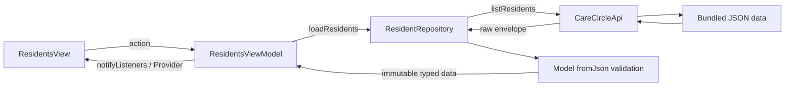

# Data flow

## Implemented resident flow

Startup composition creates the API, repository, then view model and invokes loadResidents. The UI watches only the view model. User refresh/retry goes through the same view-model action. Selection is validated/stored in the view model and survives a successful refresh if still present; empty/failed loads expose no old resident objects. Repository/API own no presentation state.

Parsing errors become a safe error state with retry. API failures are normalized without exposing payloads. Duplicate in-flight loads are ignored; late success/failure after disposal does not notify. Every API read decodes fresh JSON, and repository/model data is immutable.

## Future care-data flows — not implemented

Selected resident → view-model section action → repository/API → model validation → category/visibility filtering → domain transformation → view-model section state → UI/detail.

Preferences must be available before content is released. Skip disallowed resource/media loads when possible. Mixed endpoint records must be sanitized before state/UI/logging/counts. Scope late responses to resident selection. Independent section errors must keep other successful sections usable; no fabricated fallback.

## Future check-in — not implemented

UI input → view-model draft/validation/submitting state → repository → local mock request → parsed acknowledgement or normalized error → view model → UI.

All draft/submission/error/acknowledgement state belongs to a view model. Urgency routine/soon; blank reason yields 422. The supplied contract acknowledges locally and sends/persists nothing. Prevent duplicate submission and never imply staff notification or emergency response.
